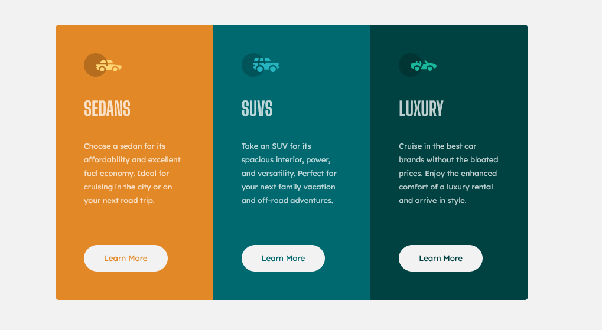

# Frontend Mentor - 3-column preview card component solution

This is a solution to the [3-column preview card component challenge on Frontend Mentor](https://www.frontendmentor.io/challenges/3column-preview-card-component-pH92eAR2-). Frontend Mentor challenges help you improve your coding skills by building realistic projects.

## Table of contents

-   [Overview](#overview)
    -   [Screenshot](#screenshot)
    -   [Links](#links)
-   [My process](#my-process)
    -   [Built with](#built-with)
    -   [What I learned](#what-i-learned)
    -   [Continued development](#continued-development)
    -   [Useful resources](#useful-resources)

## Overview

### Screenshot



### Links

-   Solution URL: [URL here]()
-   Live Site URL: [Github Pages]()

## My process

### Built with

-   CSS custom properties
-   Flexbox

### What I learned

-   set border-radius for grid-container

```css
.grid-container {
    display: grid;
    grid-template-columns: 1fr 1fr 1fr;
    border-radius: 6px;
    overflow: hidden;
}
```

-   using :nth-child(n) only for sibling

```css
/* select second item */
.item:nth-child(2) {
    ...;
}
```

### Continued development
-   why .learn-more-btn:hover can't affect button 
### Useful resources
-   [Specificity](https://developer.mozilla.org/en-US/docs/Web/CSS/Specificity#tips_for_handling_specificity_headaches)